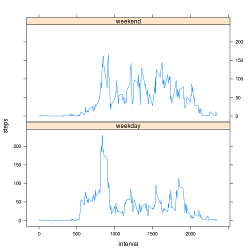

# Reproducible Research: Peer Assessment 1


## Loading and preprocessing the data

Uncompress the archive file containing the data. 


```r
unzip("activity.zip")
```

Read in the data and convert the date column to a Date type.


```r
activity <- read.csv("activity.csv")
activity$date <- as.Date(activity$date)
```


## What is mean total number of steps taken per day?

Generate a histogram showing the total number of steps taken per
day (ignoring missing values within the data).
  

```r
sums <- with(activity, aggregate(steps ~ date, FUN=sum))
hist(sums$steps, main="Total Steps per Day (Histogram)", xlab="Steps")
```

 

Compute the mean and median of the data.


```r
mean(sums$steps)
```

```
## [1] 10766
```

```r
median(sums$steps)
```

```
## [1] 10765
```


## What is the average daily activity pattern?

Remove all missing values from the data.


```r
clean = activity[complete.cases(activity),]
```

Compute and plot the average number of steps taken for each 5 minute
interval.


```r
means <- with(clean, aggregate(steps ~ interval, FUN=mean))
plot(means, type="l", xlab="Interval (hhmm)", ylab="Steps")
```

 

Compute the interval that contains the maximum average number of steps.


```r
with(means, interval[which.max(steps)])
```

```
## [1] 835
```


## Imputing missing values

Calculate the number of missing values within the data.


```r
sum(is.na(activity$steps))
```

```
## [1] 2304
```

Impute the missing values by using the average number of steps taken
for each time interval.


```r
means <- with(activity, aggregate(steps ~ interval, FUN=mean))
names(means) <- c("interval", "avg")
imputed <- merge(activity, means, by="interval")
missing <- is.na(imputed$steps)
imputed$steps <- replace(imputed$steps, missing, imputed$avg[missing])
imputed$steps <- round(imputed$steps)
```

Using the imputed data, generate a histogram showing the total number
of steps taken per day.


```r
sums <- with(imputed, aggregate(steps ~ date, FUN=sum))
hist(sums$steps, main="Total Steps per Day (Histogram)", xlab="Steps")
```

 

Compute the mean and median using the imputed values.


```r
mean(sums$steps)
```

```
## [1] 10766
```

```r
median(sums$steps)
```

```
## [1] 10762
```


## Are there differences in activity patterns between weekdays and weekends?

Create a factor variable that indicates whether the day is a weekday or
weekend day.


```r
daytype <- sapply(imputed$date, weekdays)
daytype[daytype %in% c("Saturday", "Sunday")] <- "weekend"
daytype[daytype != "weekend"] <- "weekday"
imputed <- cbind(imputed, daytype)
```

Using the lattice graphics framework, generate a time series plot
of the average number of steps taken averaged over weekdays and
weekend days.


```r
library(lattice)
means <- with(imputed, aggregate(steps ~ daytype + interval, FUN=mean))
names(means) <- c("daytype", "interval", "steps")
with(means, xyplot(steps ~ interval | daytype, layout=c(1,2), type="l"))
```

 


